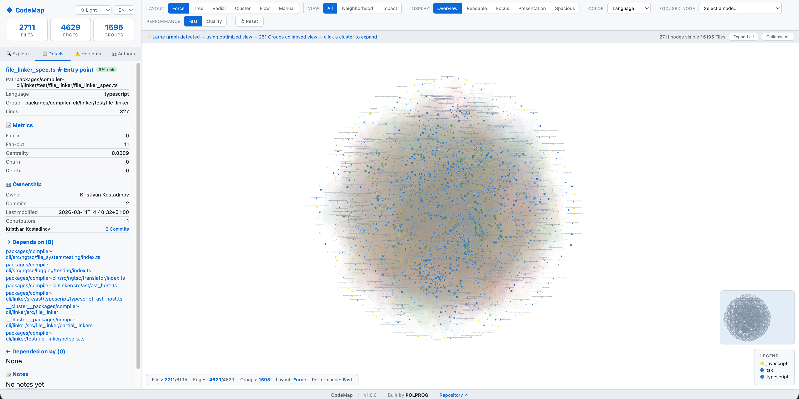
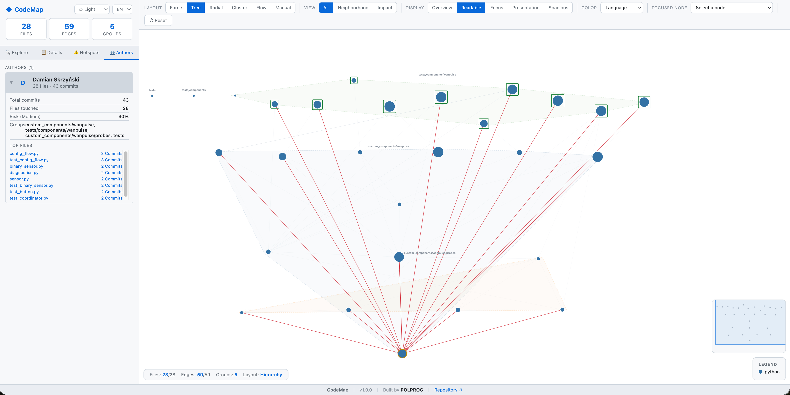
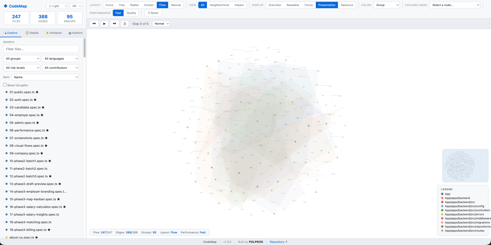

<div align="center">
  
</div>

<p align="center">
  <a href="https://www.python.org/downloads/"></a>
  
  <a href="LICENSE"></a>
  <a href="https://github.com/polprog-tech/CodeMap/actions/workflows/ci.yml"></a>
</p>

<p align="center">
  <b>Analyze, visualize, and understand any codebase in one interactive graph.</b><br>
  <sub>Dependencies . Ownership . Hotspots . Architecture . Multi-language . Self-contained HTML</sub>
</p>

<p align="center">
  <a href="#what-is-codemap">About</a> .
  <a href="#screenshots">Screenshots</a> .
  <a href="#installation">Installation</a> .
  <a href="#commands">Commands</a> .
  <a href="#visual-graph">Visual Graph</a> .
  <a href="#architecture">Architecture</a> .
  <a href="#development">Development</a>
</p>

<p align="center">
  <a href="https://buymeacoffee.com/polprog"></a>
 </p>

---

## What is CodeMap?

**CodeMap** is a framework-agnostic CLI tool that scans any repository and builds a clear, interactive map of the codebase - dependencies, ownership, hotspots, and architecture - all in a single self-contained HTML visualization.

- **What depends on what?** - Module-level import graph with fan-in/fan-out metrics
- **Who owns this code?** - Git-based contributor analysis with per-file ownership
- **Where are the risks?** - Hotspot detection: high churn × high coupling = fragile code
- **How is it structured?** - Directory grouping, hierarchy views, cluster visualization

Works on **Python, JavaScript, TypeScript, React, Angular, monorepos**, and any codebase through its extensible analyzer architecture.

---

## Screenshots

### Large Project - Collapsed Clusters & Detail Panel

Full interactive force-directed graph with automatic cluster collapsing for large repositories, detail panel showing metrics, ownership, and dependencies.

<p align="center">
  
</p>

### Author Analysis - Tree Layout

Hierarchical tree layout with expandable author accordion showing commit count, top files, and ownership breakdown.

<p align="center">
  
</p>

### Flow Layout - Presentation Mode

Animated lifecycle flow with step-by-step playback controls, group-based coloring, file explorer sidebar, minimap, and legend.

<p align="center">
  
</p>

---

## Table of Contents

- [Quick Start](#quick-start)
- [Screenshots](#screenshots)
- [Installation](#installation)
- [Commands](#commands)
- [Visual Graph](#visual-graph)
- [Ownership Analysis](#ownership-analysis)
- [Hotspot Detection](#hotspot-detection)
- [Large Projects](#large-projects)
- [Examples](#examples)
- [Architecture](#architecture)
- [Testing](#testing)
- [Development](#development)
- [Extending CodeMap](#extending-codemap)
- [Configuration](#configuration)
- [FAQ](#faq)
- [Contributing](#contributing)
- [Code of Conduct](#code-of-conduct)
- [Changelog](#changelog)
- [License](#license)

---

## Quick Start

```bash
# Clone and install
git clone https://github.com/polprog-tech/CodeMap.git
cd CodeMap
pip install -e ".[dev]"

# Scan a repository
codemap scan /path/to/your/project

# Generate an interactive HTML graph
codemap graph /path/to/your/project

# Generate a terminal report
codemap report /path/to/your/project
```

> **Note:** The `pip install` command assumes Python 3.12+ and a working `pip`. Depending on your OS, Python installation, or environment, you may need to use `pip3`, create a virtual environment first, or adjust permissions.

---

## Installation

### Requirements

- Python 3.12 or later
- Git (optional - for ownership/churn analysis)

### Install from source

```bash
git clone https://github.com/polprog-tech/CodeMap.git
cd CodeMap
pip install -e ".[dev]"
```

### Verify installation

```bash
codemap --version
```

---

## Commands

### `scan`

Discover repository files and detected technologies.

```bash
codemap scan /path/to/repo
codemap scan /path/to/repo --include "src/**/*.py"
codemap scan /path/to/repo --exclude "tests/*,docs/*"
```

**Output:** A table of discovered source files with language and line count.

### `analyze`

Build the internal dependency graph and compute metrics.

```bash
codemap analyze /path/to/repo
codemap analyze /path/to/repo --no-git
```

**Output:** Summary counts - nodes, edges, groups, and hotspot count.

### `graph`

Render an interactive dependency graph.

```bash
codemap graph /path/to/repo                     # HTML output (default)
codemap graph /path/to/repo -f json             # JSON output
codemap graph /path/to/repo -f pdf              # PDF report
codemap graph /path/to/repo -o my_output_dir    # Custom output directory
codemap graph /path/to/repo --no-git            # Skip git analysis
```

**Output:** A self-contained HTML file, JSON file, or PDF report in the output directory.

### `report`

Generate a human-readable terminal report with hotspots, ownership, and dependency insights.

```bash
codemap report /path/to/repo
codemap report /path/to/repo --json             # Also save as JSON
codemap report /path/to/repo --no-git
```

**Output:** Rich terminal tables showing hotspots, most-depended-on files, fan-out, and ownership.

---

## Visual Graph

The HTML graph output is a full-featured interactive exploration interface built with D3.js:

### Layout Modes

Switch between six graph layout engines via the toolbar:

| Layout | Description |
|--------|-------------|
| **Force** | Physics-based force-directed layout - good for seeing natural clusters |
| **Tree** | Hierarchical top-to-bottom layout by dependency depth |
| **Radial** | Concentric rings - most connected/important nodes in the center |
| **Cluster** | Nodes grouped spatially by directory/module |
| **Flow** | Lifecycle/execution-flow layout - left-to-right by bootstrap step with animation |
| **Manual** | Free-form drag-and-drop arrangement - pin nodes where you want them |

### View Modes

Focus on what matters:

| View | Description |
|------|-------------|
| **All** | Show all nodes and edges (default) |
| **Neighborhood** | Select a node, then see only its direct dependencies and reverse dependencies |
| **Impact** | Select a node, then see everything that would be affected if it changes (transitive reverse deps) |

### Color Modes

Five ways to color-code nodes:

- **Language** - colored by programming language (29 languages supported with distinct, GitHub Linguist-inspired colors)
- **Group** - colored by directory/module
- **Churn** - heat map of change frequency (yellow → red)
- **Risk** - composite risk score (green → amber → red)
- **Contributors** - number of unique contributors

### Display Modes (Readability)

Five display modes control label visibility and node spacing to keep the graph readable at any scale:

| Mode | Labels | Spacing | Best for |
|------|--------|---------|----------|
| **Overview** | Hidden (hover/tooltip only) | Dense | Large repos, orientation, big-picture navigation |
| **Readable** | Zoom-aware (appear at ~60% zoom, auto-truncated) | Wide (1.5×) | Day-to-day exploration (default) |
| **Focus** | Selected node + direct neighbors only | Standard | Inspecting a specific area without clutter |
| **Presentation** | Always visible, larger font, wider spacing (2.5×) | Wide | Demos, screenshots, small repos |
| **Spacious** | Always visible, all labels shown, extreme spacing (4×) | Very wide | Maximum readability, large repos where labels must not overlap |

**Anti-overlap strategy**: The force simulation uses **adaptive parameters** that scale with graph size. For small graphs (≤200 nodes) it uses standard spacing; for medium graphs (200-500) it increases link distance to 320 and charge to -1000; for large graphs (500+) it uses 400 link distance and -1200 charge with reduced simulation iterations. Combined with label-width-aware collision radii, zoom-gated label display, and the new collapsed-cluster view for large repos, this prevents overlapping labels at any scale.

**Focus mode**: Click any node, then switch to Focus mode - only that node and its direct neighbors show labels. Everything else fades. This is the best way to read dependencies in a dense graph.

**Spacious mode**: For large repositories, switch to Spacious mode - all labels are always visible with extreme spacing between nodes. The graph canvas becomes much larger; use zoom, pan, and the minimap to navigate.

**Tip**: Use **Overview** mode + **Neighborhood** view for quick orientation. Switch to **Focus** for detailed inspection. Use **Spacious** for full-label readability on any repo size. Use **Presentation** only for small repos or screenshots.

### Path Display

By default, nodes show short filenames (e.g., `app.py`) to keep the graph clean. Full file paths are available via:

- **Hover tooltip** - always shows the complete path
- **Details panel** - shows full path when a node is selected
- **"Show full paths" checkbox** - in the Explore tab, toggles persistent full-path labels on all nodes (collision radius automatically adjusts)

### Focused Node Exploration

The **Focused Node** dropdown in the toolbar lets you select any file/module and switch into a dedicated inspection mode:

1. **Select a node** from the dropdown (or click any node in the graph and it will appear in the dropdown)
2. A **focus bar** appears below the toolbar with sub-mode buttons:

| Sub-mode | What it shows |
|----------|---------------|
| **Local graph** | The selected node + all direct neighbors (default) |
| **Dependencies** | Only what the selected node depends on (forward deps) |
| **Reverse deps** | Only what depends on the selected node |
| **Impact chain** | Full transitive reverse dependency tree + forward deps |
| **Node flow** | The complete dependency chain through the selected node (upstream + downstream) |

This mode answers questions like:
- *What depends on this file?*
- *What does this module import?*
- *What is the local graph around this service?*
- *What chain of files is affected if I change this node?*
- *What is the full flow path through this component?*

All other nodes are dimmed to near-invisible, making the focused subgraph easy to read. Click **Clear** or select a different node to change focus.

### Sidebar Panels

Four sidebar tabs for exploration:

- **Explore** - search, filter by group/language/risk level/contributor, sort nodes, toggle path display
- **Details** - full node inspection with per-node contributor breakdown, clickable dependency links, and node notes
- **Hotspots** - ranked list of the top 20 highest-risk nodes with visual risk bars
- **Authors** - expandable accordion per contributor with total commits, files touched, average risk, top files list, and group breakdown; clicking a contributor highlights their files on the graph and dims unrelated nodes

### Language Switching (i18n)

The HTML interface supports complete UI language switching. Use the language dropdown in the sidebar header to switch between:
- **EN** - English (default)
- **PL** - Polish (fully translated)

All UI labels, tabs, filters, buttons, tooltips, legends, metric names, flow speed controls, focused exploration labels, manual layout labels, note annotations, about panel, and status texts are translated. The architecture uses a JS translation dictionary (`I18N` object), making it easy to add more languages - simply add a new key to the dictionary with translations for all ~100 UI strings.

### Flow / Lifecycle View

The **Flow** layout mode provides an animated execution-flow visualization:

- Nodes arranged left-to-right by dependency depth (bootstrap step)
- Entry points (detected via topology and name heuristics) marked with a ★ star
- **Play/Pause** - animate the bootstrap sequence step by step
- **Step Forward/Back** - manually step through the execution flow
- **Speed control** - Slow / Normal / Fast animation speed
- **Step-isolated labels** - only the current step and previous step show labels, preventing overlap during animation
- Adaptive row spacing based on column density
- Shows how dependencies are loaded in order from entry points to leaf modules

> **Note**: The flow is inferred statically from the dependency graph and entry point heuristics. It represents the import/loading order, not runtime execution. Framework-specific lifecycle enrichers can be added via the extensible architecture.

### Manual Layout Mode

The **Manual** layout lets you arrange nodes freely by hand:

1. Click the **Manual** button in the layout toolbar
2. A blue indicator bar appears confirming manual mode is active
3. **Drag any node** to place it - nodes stay pinned where you drop them
4. Use **zoom and pan** to navigate the large canvas
5. **Save layout** - saves all node positions to `localStorage` (per-page key)
6. **Restore layout** - restores a previously saved arrangement
7. Click **Return to auto layout** to switch back to a simulation-driven layout (all pins are cleared)

Manual mode is ideal for:
- Creating custom architecture diagrams
- Arranging nodes for presentations or screenshots
- Organizing complex areas that automatic layouts handle poorly
- Exploring the graph while maintaining a stable arrangement

**Layout persistence**: Saved layouts are stored in `localStorage` using a key derived from the page URL. They persist across browser sessions for the same file. To clear: delete the `codemap-layout-*` keys from localStorage, or click "Return to auto layout".

### Node Notes / Annotations

You can attach notes to any node for documentation, reminders, or architecture commentary:

1. **Click a node** to open its details panel
2. In the **Notes** section, click **Add note**
3. A modal editor appears (the note editor is hidden by default and only appears on action)
4. Type your annotation and click **Save**
5. A 📝 indicator appears on the node in the graph
6. Notes are visible in the details panel and can be edited or removed

Use cases:
- Architecture decisions and rationale
- Refactoring reminders
- Ownership or responsibility notes
- Warnings about fragile or deprecated code

> **Note**: Notes are stored in memory for the current session. The note editor modal is hidden by default and only appears when the user explicitly adds or edits a note.

### Additional Features

- **Zoom & pan** - scroll to zoom (down to 4%), drag to pan the graph
- **Minimap** - bottom-right corner shows a minimap of the full graph; click to navigate
- **Hover tooltips** - full path, language, metrics, dependency counts, risk score, owner, and contributors
- **Click details** - click any node to see full details + dependency lists
- **Dependency highlighting** - forward deps shown in blue, reverse deps in red
- **Arrow markers** - directional arrows on edges show dependency flow
- **Group hulls** - expanded convex hulls with labels cluster files visually
- **Hotspot rings** - pulsing red rings highlight high-risk nodes (in Risk color mode)
- **Node sizing** - larger nodes = more lines of code
- **Summary cards** - file/edge/group counts at the top of the sidebar
- **Stats bar** - live node/edge counts reflecting current filters
- **Dynamic legend** - updates based on the active color mode
- **Entry point markers** - green bordered squares highlight detected entry points
- **Author highlighting** - click an author in the Authors tab accordion to highlight their files on the graph and dim unrelated nodes; click file entries to navigate directly

### Language Color Palette

When using the **Language** color mode, each programming language has a distinct, professionally chosen color inspired by the GitHub Linguist palette. Supported languages include:

Python, JavaScript, TypeScript, JSX/TSX, Java, Go, Rust, Ruby, PHP, Swift, Kotlin, C#, C++, C, HTML, CSS, SCSS, Vue, Svelte, Dart, Scala, Shell, SQL, JSON, YAML, Markdown, TOML.

Unknown file types are shown in neutral gray. The legend is **dynamic** - it only displays languages actually present in the analyzed project, keeping it clean and relevant. Future languages can be added by extending the `Language` enum and the `LANG_COLORS` mapping.

Open the generated `codemap.html` in any modern browser.

---

## Ownership Analysis

When git history is available, CodeMap enriches each file with:

| Metric | Description |
|--------|-------------|
| **Primary owner** | Contributor with the most commits to the file |
| **Total commits** | Number of commits touching the file |
| **Last modified** | Date of the most recent commit |
| **Last modifier** | Author of the most recent commit |
| **Contributor count** | Number of unique contributors |

Ownership degrades gracefully - if git is unavailable or the directory has no history, CodeMap continues without ownership data.

Use `--no-git` to explicitly disable git analysis.

---

## Hotspot Detection

Hotspots are files that are both **highly depended-on** (high fan-in) and **frequently changed** (high churn). These represent the riskiest areas of a codebase.

A file is flagged as a hotspot when:
- `churn >= 10` (commits touching the file)
- `fan_in >= 3` (files that depend on it)

These thresholds are configurable.

---

## Large Projects

> **⚠️ Performance note:** Large repositories (1 000+ files) may take longer to analyze, and the interactive graph may be slower to render and navigate. Git ownership analysis is the most expensive operation. Use `--fast` mode to skip it, enable the collapsed cluster view for smoother rendering, and prefer focused single-node exploration over full-graph views. See tips below.

CodeMap is designed to work on large repositories (thousands of files). All commands provide **real-time progress feedback** through every stage of processing:

```
◆ CodeMap Graph  /path/to/angular
✓ Scanned 6195 files
► Building node graph…
► Building directory groups…
► Extracting dependencies…
► Analyzing git ownership…
► Computing metrics…
► Rendering HTML output…
✓ Output written to: codemap_output/codemap.html
```

### Performance

Git analysis uses **batch operations** - two `git log` calls total regardless of repository size, instead of per-file subprocess calls. This makes ownership analysis orders of magnitude faster on large repos.

### `--fast` Mode

Skip git analysis entirely for fastest possible output:

```bash
codemap graph /path/to/large-repo --fast
codemap analyze /path/to/large-repo --fast
```

This is equivalent to `--no-git` but explicitly optimized for speed. It skips ownership/churn analysis completely, producing graphs based purely on code structure and dependencies.

### Progressive / Collapsed View for Large Graphs

When the graph exceeds **200 nodes**, the HTML visualization automatically activates **Fast performance mode**:

- **Collapsed clusters** - Directory groups with more than 5 files are shown as single cluster nodes instead of expanding every file. This dramatically reduces DOM overhead and improves rendering speed.
- **Click to expand** - Click any cluster node to expand its files into the graph.
- **Expand all / Collapse all** - Controls in the performance banner let you toggle between collapsed and fully expanded views.
- **Adaptive simulation** - Force simulation parameters (link distance, charge strength, collision iterations) scale automatically with graph size.
- **Throttled rendering** - On large graphs, expensive DOM operations (hulls, rings, markers) run every 3rd tick instead of every tick.
- **Stricter zoom-gated labels** - Labels only appear when zoomed in closer, reducing SVG text elements.

A **performance banner** appears below the toolbar showing the current mode and node counts. Use the **Fast / Quality** toggle in the toolbar to switch between collapsed and fully expanded views.

### Cancellation

All long-running commands handle `Ctrl+C` gracefully - processing stops immediately with a clean `Cancelled.` message and no partial output corruption.

### Tips for large repos

- Use `--fast` or `--no-git` to skip git analysis entirely if you only need the dependency graph
- The HTML graph includes zoom, pan, minimap, and focused node exploration for navigating large visualizations
- Use the "Spacious" display mode for best readability on large graphs
- Use the node dropdown to inspect individual files/modules without full-graph clutter
- In Fast performance mode, click cluster nodes to expand only the areas you want to explore
- Switch to Quality mode when you want to see all individual files at once

---

## Examples

The `examples/` directory contains two demo projects:

### Python project

```bash
codemap scan   examples/python_project
codemap graph  examples/python_project --no-git
codemap report examples/python_project --no-git
```

A small Python app with services, models, and utilities that import each other.

### JavaScript project

```bash
codemap scan   examples/js_project
codemap graph  examples/js_project --no-git
codemap report examples/js_project --no-git
```

A React-style app with components, services, and shared utilities.

---

## Architecture

CodeMap uses a clean layered architecture:

```
src/codemap/
├── cli/              # Typer CLI commands (presentation layer)
├── application/      # Use-case orchestration (scan, analyze, graph, report)
├── domain/           # Core graph model, metrics, protocols (zero dependencies)
├── infrastructure/   # Git integration, file system, language extractors
└── rendering/        # Output formatters (JSON, terminal, HTML, PDF)
```

**Key design principles:**
- **Domain layer has zero external dependencies** - pure Python dataclasses and protocols
- **Infrastructure is pluggable** - extractors implement the `DependencyExtractor` protocol
- **Rendering is decoupled** - renderers implement the `GraphRenderer` protocol
- **Git analysis is isolated** - behind a clean interface with graceful degradation
- **Framework-agnostic** - no React/Angular/etc. assumptions in the core

See [docs/architecture.md](docs/architecture.md) for the full design document.

---

## Testing

```bash
# Run the full test suite
python -m pytest tests/ -v

# With coverage
python -m pytest tests/ --cov=codemap --cov-report=term-missing
```

The test suite covers:
- Repository scanning with include/exclude rules
- Python and JavaScript dependency extraction
- Graph construction and queries
- Reverse dependency analysis
- Metric computation (fan-in, fan-out, centrality, hotspots)
- Ownership model behavior
- JSON, HTML, PDF, and terminal rendering
- All CLI commands (happy paths and error paths)
- Full analysis pipeline integration
- Graceful behavior without git

All tests use **GIVEN / WHEN / THEN** structure for readability.

---

## Development

### Setup

```bash
git clone https://github.com/polprog-tech/CodeMap.git
cd CodeMap
pip install -e ".[dev]"
```

### Quality checks

```bash
# Lint
ruff check src/ tests/

# Format check
ruff format --check src/ tests/

# Type check
mypy src/codemap/ --ignore-missing-imports

# Tests
python -m pytest tests/ -v

# Run all checks at once
ruff check src/ tests/ && ruff format --check src/ tests/ && mypy src/codemap/ --ignore-missing-imports && python -m pytest tests/ -q
```

### Auto-fix formatting

```bash
ruff format src/ tests/
ruff check src/ tests/ --fix
```

### CI

The GitHub Actions workflow (`.github/workflows/ci.yml`) runs on Python 3.12 and 3.13:

1. Install - `pip install -e ".[dev]"`
2. Lint - `ruff check src/ tests/`
3. Format - `ruff format --check src/ tests/`
4. Type check - `mypy src/codemap/ --ignore-missing-imports`
5. Tests - `python -m pytest tests/ -v --tb=short`

All checks must pass before merging.

---

## Extending CodeMap

### Adding a new language analyzer

1. Create a new file in `src/codemap/infrastructure/extractors/`
2. Implement the `DependencyExtractor` protocol:

```python
class RubyExtractor:
    @property
    def supported_extensions(self) -> frozenset[str]:
        return frozenset({".rb"})

    def can_handle(self, file_path: Path) -> bool:
        return file_path.suffix == ".rb"

    def extract(self, file_path: Path, content: str, repo_root: Path) -> list[Edge]:
        # Parse Ruby requires/imports and return edges
        ...
```

3. Register it in `src/codemap/application/analyzer.py`

### Adding a new renderer

Implement the `GraphRenderer` protocol:

```python
class SvgRenderer:
    @property
    def format_name(self) -> str:
        return "svg"

    def render(self, graph: CodeGraph, output_path: Path) -> Path:
        # Produce an SVG file
        ...
```

See [docs/extensibility.md](docs/extensibility.md) for more details.

---

## Configuration

| Option | CLI Flag | Default | Description |
|--------|----------|---------|-------------|
| Repository path | positional | `.` | Path to scan |
| Include patterns | `--include` | all files | Comma-separated globs |
| Exclude patterns | `--exclude` | none | Comma-separated globs |
| Output directory | `--output`, `-o` | `codemap_output/` | Where to write outputs |
| Output format | `--format`, `-f` | `html` | `html`, `json`, or `pdf` |
| Disable git | `--no-git` | false | Skip ownership/churn analysis |
| JSON report | `--json` | false | Also save report as JSON |

---

## FAQ

**Q: Does CodeMap require git?**
No. Git analysis is optional. Use `--no-git` or CodeMap will simply skip ownership data if git is unavailable.

**Q: What languages are supported?**
Python, JavaScript, TypeScript, JSX, and TSX out of the box. The extractor architecture makes it straightforward to add more.

**Q: Can I use CodeMap in CI?**
Yes. Use `codemap graph --no-git -f json` for machine-readable output suitable for CI pipelines. Use `-f pdf` for shareable reports.

**Q: How does CodeMap handle monorepos?**
CodeMap scans the entire directory tree. Use `--include` and `--exclude` patterns to focus on specific packages.

---

## Release Notes

See [CHANGELOG.md](CHANGELOG.md) for release history. CodeMap follows [Semantic Versioning](https://semver.org/).

## Author

Created and maintained by **[POLPROG](https://polprog.pl/)** ([@polprog-tech](https://github.com/polprog-tech)).

- **Report issues:** [GitHub Issues](https://github.com/polprog-tech/CodeMap/issues)
- **Feature requests:** [GitHub Discussions](https://github.com/polprog-tech/CodeMap/discussions)
- **Documentation:** [docs/architecture.md](docs/architecture.md)

---

## Contributing & Community

- [Contributing Guide](CONTRIBUTING.md) - development setup, code style, PR guidance
- [Code of Conduct](CODE_OF_CONDUCT.md) - expected behavior for contributors and maintainers
- [Security Policy](SECURITY.md) - how to privately report security vulnerabilities
- [Changelog](CHANGELOG.md) - release history and notable changes

## License

This project is licensed under the [MIT License](LICENSE).
